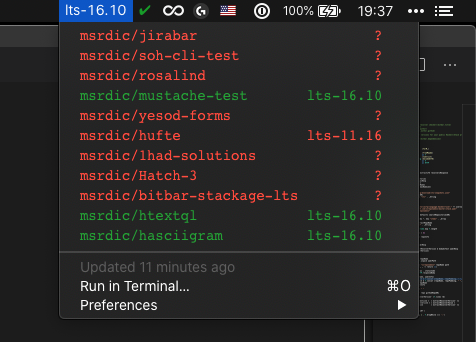

# bitbar-stack-resolver-checker

Built on top of [bitbar-stackage-lts](https://github.com/msrdic/bitbar-stackage-lts), this plugin checks `stack.yaml` declared resolver for all your public Haskell repositories and if they match the LTS supplied by [Stackage](https://www.stackage.org/lts).

## Preview

## Prerequisites

 1. [stack](https://docs.haskellstack.org/en/stable/README/)
 2. [BitBar](https://github.com/matryer/bitbar)

If you don't already have it, stack will install ghc(i) and needed dependencies on the first run, which can take a while.

## Usage

 1. copy `Main.hs` to your Bitbar plugins folder
 2. rename to `<something>.<update_period>.hs`
 3. make executable (`chmod +x`)
 4. replace the username value with your own ([right now it says](https://github.com/msrdic/bitbar-stack-resolver-checker/blob/master/Main.hs#L50) `username = "msrdic"`, which will show my Haskell repos)

More information about BitBar and installing plugins can be found [here](https://github.com/matryer/bitbar#installing-plugins).